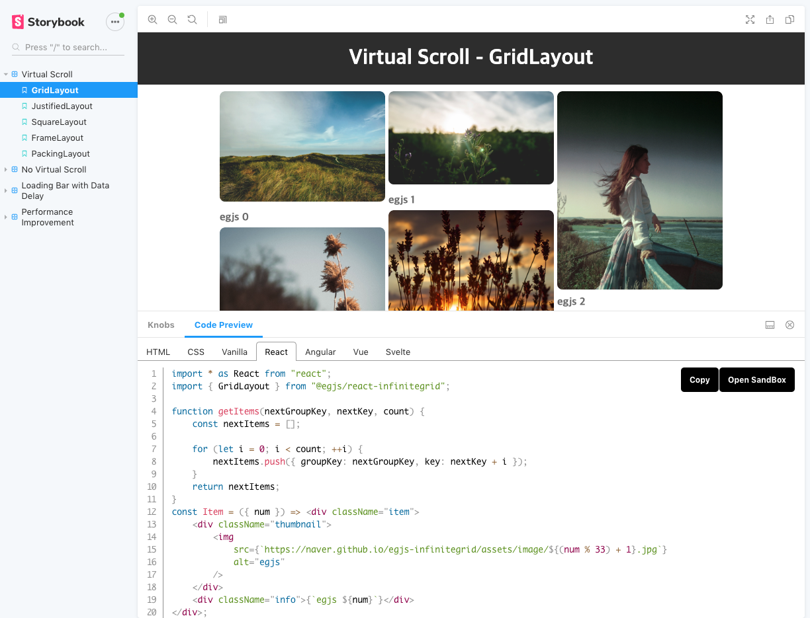

# Storybook Addon Preview

[](https://badge.fury.io/js/storybook-addon-preview)

Storybook Addon Preview can show user selected [knobs](https://github.com/storybookjs/storybook/tree/master/addons/knobs) in various framework code in [Storybook](https://storybook.js.org/)


[](https://naver.github.io/egjs-infinitegrid/storybook/)

## Getting Started
First of all, you need to install Knobs into your project as a dev dependency.


```
npm i storybook-addon-preview --dev
```


.storybook/addons.js

```js
import "storybook-addon-preview/register";
```

Now, write your stories with preview.

```js
import { withPreview, previewTemplate, DEFAULT_VANILLA_CODESANDBOX } from "storybook-addon-preview";
import { withKnobs, boolean, number } from "@storybook/addon-knobs";

const stories = storiesOf("Example", module);

stories.addDecorator(withKnobs).addDecorator(withPreview);

stories.add("Example", e => {
    const opt1 = boolean("opt1", false);
    const opt2 = number("num1", 0);

    return ....;
}, {
    preview: [
        {
            tab: "Vanilla",
            template: previewTemplate`
const inst = new Instance({
    opt1: ${"opt1"},
    num1: ${"num1"},
});
            `,
            language: "ts",
            copy: true,
            codesandbox: DEFAULT_VANILLA_CODESANDBOX(["@egjs/infinitegrid"]),
        },
    ]
});
```


[InfiniteGrid's Storybook Example](https://github.com/naver/egjs-infinitegrid/blob/master/storybook/stories/templates/story.template.tsx)

### Properties

|Name|Type|Description|
|---|---|---|
|tab|string|preview can show multiple tab and can determine the name of the tab. If you have the same name, you can show multiple codes on one tab.|
|template|string, function|Code to display on the screen. If you use knobs, use previewTemplate. If the knobs are not used, they can be represented as strings.|
|knobs|object|Custom knobs to use in preview templates, except those used in stories,|
|continue|boolean|If the tab name is the same and the code is different, enable true if you want to continue the line number.|
|lanauge|string|Language to highlight the code in the template (js, ts, jsx, tsx, html, css)|
|codesandbox|function|Link the code you used to the code sandbox.|
|copy|boolean|Whether to show the copy code button|

### Template
* If the template is code that does not use knobs, you can just write it as `string` type.
```js
{
    template: `
const inst = new Instance({
    opt1: 1,
    num1: 1,
});
`,
}
```
* If you simply want to express knobs as they are, use `previewTemplate` function
```js
import { previewTemplate } from "storybook-addon-preview";

{
    template: previewTemplate`
const inst = new Instance({
    opt1: ${"opt1"},
    num1: ${"num1"},
});
`,
}
```
* Use functions if you want to work with variables
```js
{
    template: knobs => `
const inst = new Instance({
    opt1: ${knobs.opt1},
    num1: ${knobs.num1},
});
`,
}
```


### CodeSandBox
Link the code you used to the code sandbox.
There is a dependency and initial settings file for linking code sandboxes.
The frameworks we support are react, angular, svelte, lit, preact, and vue.

```js
const CodeSandboxTemplate = (previews) => ({
    // react, angular, svelte, lit, preact, vue
    framework: "FRAMEWORK_TYPE",
      files: {
        // Tab name and code order (Mostly 0)
        "src/App.tsx": previews["TAB NAME"][0],
        "src/styles.css": previews["TAB NAME2"][0],
    },
    // External modules except framework modules used in code
    userDependencies: ["@egjs/react-infinitegrid@latest"],
});
```

#### You can use the default codesandbox presets.
* External modules except framework modules used in code

```ts
// DEFAULT_(VANILLA)_CODESANDBOX
// DEFAULT_(REACT)_CODESANDBOX
// DEFAULT_(ANGULAR)_CODESANDBOX
type DEFAULT_FRAMEWORK_CODESANDBOX = (dependencies: string[]) => CodeSandboxTemplate;
```

* The codesandbox presets provided in the preview are vanilla, react, angular, vue, preact, lit and svelte.

|Name|Required Tab Names|Code|
|----|---|---|
|DEFAULT_VANILLAJS_CODESANDBOX(JS)|HTML, CSS, VANILLA|[View Code](https://github.com/naver/storybook-addon-preview/blob/master/src/codesandbox/VanillaJS.ts)|
|DEFAULT_VANILLA_CODESANDBOX(TS)|HTML, CSS, VANILLA|[View Code](https://github.com/naver/storybook-addon-preview/blob/master/src/codesandbox/Vanilla.ts)|
|DEFAULT_REACT_CODESANDBOX(TS)|React, CSS|[View Code](https://github.com/naver/storybook-addon-preview/blob/master/src/codesandbox/React.ts)
|DEFAULT_ANGULAR_CODESANDBOX|CSS, Angular(html, component, module)|[View Code](https://github.com/naver/storybook-addon-preview/blob/master/src/codesandbox/Angular.ts)|
|DEFAULT_VUE_CODESANDBOX|Vue|[View Code](https://github.com/naver/storybook-addon-preview/blob/master/src/codesandbox/Vue.ts)|
|DEFAULT_SVELTE_CODESANDBOX|Svelte|[View Code](https://github.com/naver/storybook-addon-preview/blob/master/src/codesandbox/Svelte.ts)|
|DEFAULT_LIT_CODESANDBOX|Lit|[View Code](https://github.com/naver/storybook-addon-preview/blob/master/src/codesandbox/Lit.ts)|


#### The following explains how to use the default codesandbox preset.


```ts
import {
    DEFAULT_VANILLA_CODESANDBOX,
    DEFAULT_REACT_CODESANDBOX,
    DEFAULT_ANGULAR_CODESANDBOX,
} from "storybook-addon-preview";

{
    preview: [
        {
            // previews["HTML"][0]
            tab: "HTML",
            template: ...,
        },
        {
            // previews["CSS"][0]
            tab: "CSS",
            template: ...,
        },
        {
            // previews["Vaniila"][0]
            tab: "Vanilla",
            template: ...,
            codesandbox: DEFAULT_REACT_CODESANDBOX(["@egjs/infinitegrid"]),
        }
        {
            // previews["React"][0]
            tab: "React",
            template: ...,
            codesandbox: DEFAULT_REACT_CODESANDBOX(["@egjs/react-infinitegrid"]),
        },
        {
            // previews["Angular"][0]
            tab: "Angular",
            description: "app.component.html",
            template: ...,
            language: "markup",
            codesandbox: DEFAULT_ANGULAR_CODESANDBOX(["@egjs/ngx-infinitegrid"]),
        },
        {
            // previews["Angular"][1]
            tab: "Angular",
            description: "app.component.ts",
            template: ...,
            language: "tsx",
            codesandbox: DEFAULT_ANGULAR_CODESANDBOX(["@egjs/ngx-infinitegrid"]),
        },
        {
            // previews["Angular"][2]
            tab: "Angular",
            description: "app.module.ts",
            template: ...,
            language: "typescript",
            codesandbox: DEFAULT_ANGULAR_CODESANDBOX(["@egjs/ngx-infinitegrid"]),
        },
    ],
}
```


## License
**storybook-addon-preview** is released under the [MIT license](https://raw.githubusercontent.com/naver/egjs/master/LICENSE.txt).


```
Copyright (c) 2020-present NAVER Corp.

Permission is hereby granted, free of charge, to any person obtaining a copy
of this software and associated documentation files (the "Software"), to deal
in the Software without restriction, including without limitation the rights
to use, copy, modify, merge, publish, distribute, sublicense, and/or sell
copies of the Software, and to permit persons to whom the Software is
furnished to do so, subject to the following conditions:

The above copyright notice and this permission notice shall be included in
all copies or substantial portions of the Software.

THE SOFTWARE IS PROVIDED "AS IS", WITHOUT WARRANTY OF ANY KIND, EXPRESS OR
IMPLIED, INCLUDING BUT NOT LIMITED TO THE WARRANTIES OF MERCHANTABILITY,
FITNESS FOR A PARTICULAR PURPOSE AND NONINFRINGEMENT.  IN NO EVENT SHALL THE
AUTHORS OR COPYRIGHT HOLDERS BE LIABLE FOR ANY CLAIM, DAMAGES OR OTHER
LIABILITY, WHETHER IN AN ACTION OF CONTRACT, TORT OR OTHERWISE, ARISING FROM,
OUT OF OR IN CONNECTION WITH THE SOFTWARE OR THE USE OR OTHER DEALINGS IN
THE SOFTWARE.
```
